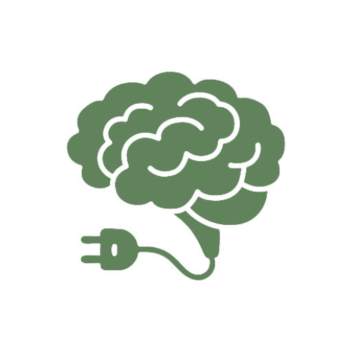
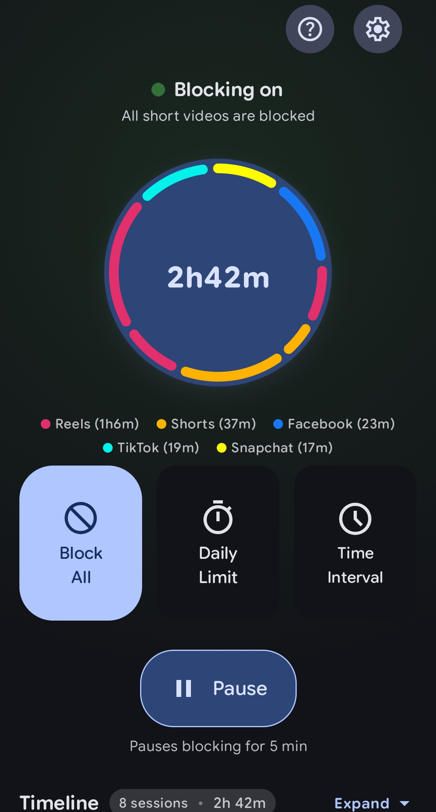

<div align="center">



# 🚫 Scrolless — Block Reels, Shorts &amp; TikTok

### *The open-source anti brain-rot app for Android*

**Block Instagram Reels. Block YouTube Shorts. Block TikTok. Stop doomscrolling and get your attention back.**

[](https://github.com/Xeven777/Scrolless/releases/latest)
[](LICENSE)
[](#-download)
[](#-contributing)

<br>

[**⬇️ Download**](#-download) · [**✨ Features**](#-features) · [**🛠️ Build**](#-building-from-source) · [**❓ FAQ**](#-faq) · [**🤝 Contributing**](#-contributing) · [**📄 License**](#-license)

</div>

---

## 🤔 Why Scrolless?

You open Instagram to "quickly check a message"... and 40 minutes vanish into Reels. 😵‍💫

**Scrolless** is a fully open-source Android **short-form video blocker** that detects and blocks "brain rot" content — *while you're scrolling it*. It uses Android's **Accessibility Service** to recognize **Instagram Reels**, **YouTube Shorts**, **TikTok**, **Facebook Reels**, **Snapchat Spotlight** and **YouTube Kids / ReVanced** the moment they appear, and gets you out before the doomscroll begins.

> 🔐 **The accessibility permission can be abused — which is exactly why Scrolless is 100% open source.** Don't trust us, *read the code*. Every permission and every detection rule is here for you to audit.

## 🧠 What is Scrolless?

Scrolless is an **anti-doomscrolling** and **screen-time control** app for Android that targets *short-form feed content* specifically — Reels, Shorts, TikToks and Spotlight — instead of locking your whole phone. If you want to keep chatting on Instagram but stop losing hours to Reels, that is exactly the gap Scrolless fills.

It is an alternative to generic app blockers and digital-wellbeing timers that either block too much (a whole app) or too little (a nudge you can swipe away). Scrolless intervenes at the moment the feed appears.

**Built for people who want to:** quit doomscrolling, reduce short-form video screen time, focus on study or work, take control of their attention, or simply keep Reels and Shorts out of reach without deleting social apps entirely.

## ✨ Features

| | |
|---|---|
| 🚫 **Block All** | Instantly block every supported platform — Instagram Reels, YouTube Shorts, TikTok, Facebook Reels and Snapchat Spotlight. |
| ⏳ **Daily Limit** | Set a daily screen-time budget for supported apps. Hit the cap? You're locked out of the feed until tomorrow. |
| ⏱️ **Live Brain Rot Timer** | A real-time overlay timer follows your Shorts/Reels session so you always know how long you've been scrolling. |
| ⏸️ **Pause** | Need a quick breather? Pause blocking for 5 minutes and get back to it afterwards. |
| 🔁 **Interval Timer** | Alternate between usage and break windows for controlled social media access throughout the day. |
| 📊 **Usage Tracking** | Detailed stats on time spent per app — Reels, Shorts, TikTok, Facebook and Spotlight, broken down by session. |

### 📱 Supported apps

`Instagram Reels` · `YouTube Shorts` · `YouTube Kids` · `YouTube ReVanced` · `TikTok` · `TikTok Lite` · `Facebook` · `Facebook Lite` · `Snapchat Spotlight`

Stories, DMs and dedicated viewers are handled too — Scrolless knows the difference between a Reel and a video someone sent you in DMs. 💬

## ⚙️ How it works

Scrolless runs an Android **Accessibility Service** that watches which app and screen is in the foreground. When it recognizes a short-form feed — a Reel, a Short, a TikTok or Spotlight — it draws an overlay over the video and blocks the scroll, while leaving the rest of the app (inbox, profile, messages) untouched.

Because the detection happens locally on your device against a small set of rules, **nothing is uploaded, there is no account, and there are no ads or trackers.**

<div align="center">
  &nbsp;
  
  &nbsp;
</div>


## ⬇️ Download

Grab the latest APK from the releases page:

**👉 [Releases](https://github.com/Xeven777/Scrolless/releases/latest)**

1. Download the latest `.apk` from the release page
2. Install it on your device (**Android 8.0+** / Android Oreo or newer)
3. Open Scrolless and grant the **Accessibility** permission when prompted
4. Set your limits and stop the scroll 🎉

> 💡 **Tip:** Android may warn about "unknown apps" when installing an APK — that's standard for anything installed outside the Play Store. Scrolless is open source, so you can verify the build yourself if you're paranoid (in a good way 🕵️).

## 🛠 Building from source

**Requirements**

- 🧰 [Android Studio](https://developer.android.com/studio) (or just a terminal)
- ☕ JDK 17
- 🤖 Android SDK 37

**Build**

```bash
git clone https://github.com/Xeven777/Scrolless.git
cd Scrolless
./gradlew :app:assembleDebug
# APK → app/build/outputs/apk/debug/app-debug.apk
```

**Checks used by CI**

```bash
./gradlew spotlessCheck   # 🎨 code formatting
./gradlew test            # 🧪 unit tests
./gradlew :app:lintDebug  # 📝 android lint
```

### 📦 Project structure

```
Scrolless/
├── app/                  # 📱 Application module (UI shell, overlays, accessibility service)
├── core/
│   ├── data/             # 💾 Repositories + local database
│   ├── domain/           # 🧠 Detection rules & business logic
│   ├── designsystem/     # 🎨 Theme, colors, typography
│   └── logging/          # 🪵 Logging utilities
└── feature/
    ├── home/             # 🏠 Home, timers & usage analytics
    └── settings/         # ⚙️ Settings screen
```

Built with **Kotlin**, **Jetpack Compose**, **Hilt**, **Room**, and a lot of ☕.

## ❓ FAQ

**Does Scrolless block Instagram entirely?**
No. You choose the mode. **Block All** blocks every supported short-form feed, while **Daily Limit** and **Interval Timer** only stop you once your budget is used up. DMs, Stories and profiles stay usable.

**Can it block YouTube Shorts without blocking normal YouTube videos?**
Yes. Scrolless detects the Shorts player specifically, so regular long-form YouTube videos keep working.

**Is it free?**
Yes. Scrolless is free and open source under the **GPL-3.0** license. There are no ads, no subscriptions and no in-app purchases.

**Does it collect my data?**
No. Detection runs entirely on your device. There is no account, no analytics SDK and no cloud sync — you can verify this by reading the source.

**Why does it need the Accessibility permission?**
Accessibility is the only Android API that lets an app see which screen is on the foreground and draw an overlay over it. That is exactly what's needed to spot a Reel the instant it appears. It's a powerful permission, which is why the whole app is open source.

**How do I uninstall it?**
Turn off the Accessibility service in **Settings → Accessibility → Scrolless**, then uninstall the app normally. Never leave an accessibility service enabled after you've stopped using it.

**Which Android versions are supported?**
Android 8.0 (Oreo) and newer.

**Does it work on iOS?**
No — Scrolless is Android-only. The blocking approach relies on Android's Accessibility Service, which has no iOS equivalent.

## 🔧 Troubleshooting

**Scrolless isn't blocking anything.**
Open **Settings → Accessibility** and confirm the Scrolless service is switched on. Android silently disables accessibility services after some system updates.

**Blocking stopped after a phone restart.**
Some OEMs (Xiaomi, Samsung, OnePlus and others) aggressively kill background services. Add Scrolless to your battery-optimisation allow-list to keep it running.

**A new short-form feed slips through.**
Detection rules live in the open-source code and improve over time — [open an issue](https://github.com/Xeven777/Scrolless/issues) with the app and screen name and it can be added.

**The in-app timer overlay is missing.**
Check that **Show on-screen timer** is enabled in Scrolless settings.

## 🤝 Contributing

Contributions make the ocean grow 🌊 — bug reports, feature ideas and pull requests are all welcome!

1. 🍴 Fork the repo
2. 🌿 Create your feature branch (`git checkout -b feature/amazing-thing`)
3. ✅ Run `./gradlew spotlessCheck test`
4. 💾 Commit (`git commit -m 'Add amazing thing'`)
5. 📤 Push (`git push origin feature/amazing-thing`)
6. 📩 Open a Pull Request

Found a bug, or an app that slips past the filter? [Open an issue](https://github.com/Xeven777/Scrolless/issues) — the smarter the detection rules get, the fewer Reels everyone watches. 🧠

## 💖 Support

If Scrolless saved you from an hour of Reels, consider ⭐ starring the repo — it really helps!

## 🔑 Keywords

reels blocker · shorts blocker · tiktok blocker · block instagram reels · block youtube shorts · stop doomscrolling · anti doomscroll app · brain rot app · screen time control android · digital wellbeing alternative · app blocker android · open source app blocker · accessibility service blocker · short-form video blocker · focus app android · facebook reels blocker · snapchat spotlight blocker · kotlin jetpack compose app

## 📄 License

Scrolless is licensed under the [GNU General Public License v3.0](LICENSE) — free as in freedom ✊.

```
Copyright (C) 2026 Anish (Xeven777)
```

Some bundled assets (fonts, icons) are covered separately under the [ASSETS_LICENSE](ASSETS_LICENSE).

---

<div align="center">

**Maintained with ❤️ by [Anish](https://github.com/Xeven777)**. Inspired from [Scrolless](https://github.com/duartebarbosadev/scrolless).

🎸 <a href="https://github.com/Xeven777">GitHub</a> · ⭐ <a href="https://github.com/Xeven777/Scrolless">Star Scrolless</a> · 🐛 <a href="https://github.com/Xeven777/Scrolless/issues">Report an issue</a>

</div>
